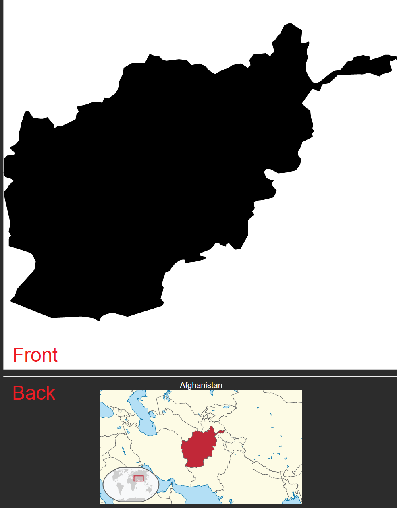

This is an Anki deck for learning the shapes of the countries of the world. (For getting good at the game [Worldle](https://worldle.teuteuf.fr/))

#### Installation: 

* First get the [CrowdAnki](https://ankiweb.net/shared/info/1788670778) plugin and restart Anki.

* Then do File -> "CrowdAnki: Import git repository"

* It will ask for a URL. Give it this one: `https://github.com/Hyphen-ated/ankiCountryShapes/`

Example card: 

Thanks https://github.com/djaiss/mapsicon and https://github.com/anki-geo/ultimate-geography, where I got most of the images used in this deck.
